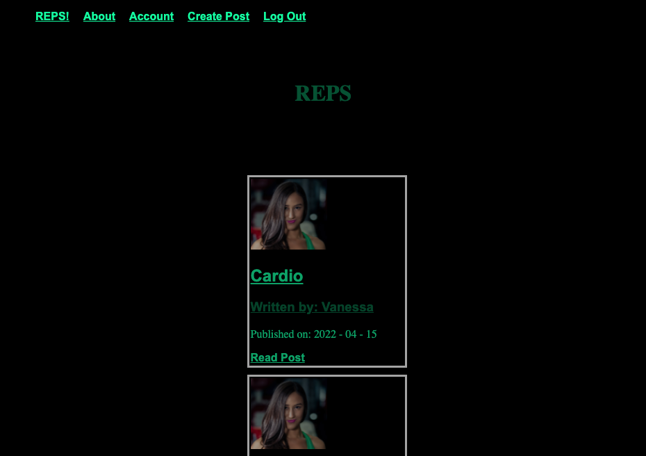
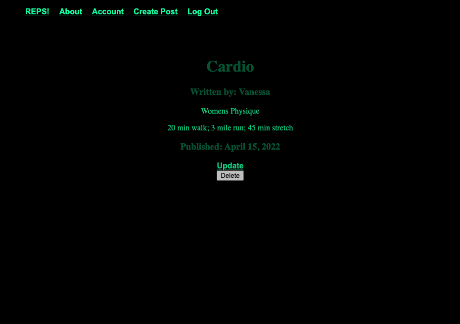

# Reps

## Objective:

Reps, is a social experience for the fitness community, where users can post and promote their daily workouts and accomplishments. The objective is to inspire others who may want to pursue similar goals and as motivation knowing that with every rep, you are that much closer to your desired outcome. Let REPS be a witness to your journey. How far have you come?

## Screenshots:

## To Access the app click here

[REPS](https://reps-level-up.herokuapp.com/)

## Motivation:

This full stack app with implemented authentication uses Pythons Flask Web framework. Allowing users to create secure accounts, make and edit posts and view the chronological progression of their fitness journey.

## Technologies implemented:

- HTML5
- CSS3
- PYTHON
- FLASK
- PSQL

## IceBox Items:
- Include a location feature to allow members to connect with others in their local community
- Search function on individual contributors
- Add option to include photos with every post
- Suggest members based on the popularity of their posts 
  
